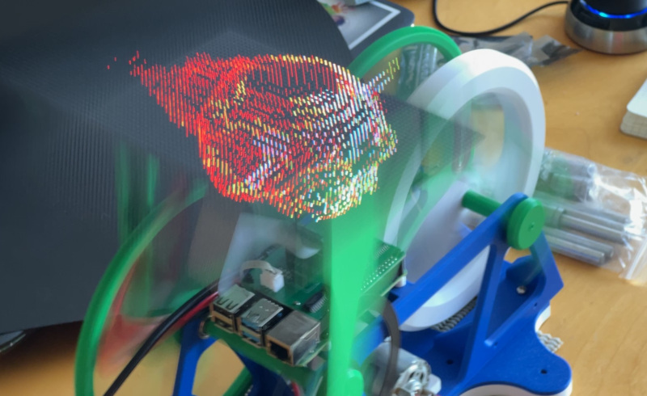
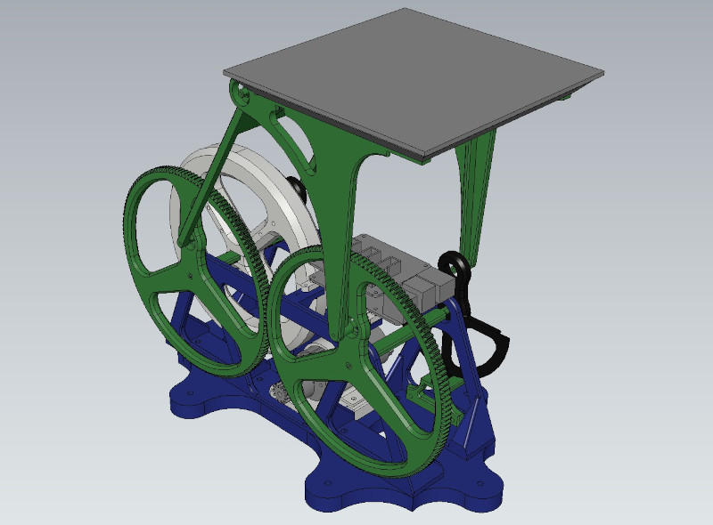

Oscivox - An Undulating Volumetric Display
==========================================

This is a snapshot of an abandoned undulating volumetric display project. A better display can be found [here](https://github.com/AncientJames/VortexParts), and better code for it can be found [here](https://github.com/AncientJames/multivox).

This is a swept volume display, similar in principle to the rotating displays. The idea with this build was to see if I could get the benefits of a linear volume, but reduce the jerk at the ends of the sweep by giving it an undulating motion. I didn't take it beyond this test object.

It uses a Raspberry Pi 4 and a 64x64 LED matrix. The driver presents a memory mapped voxel buffer that's (roughly?) compatible with [Multivox](https://github.com/AncientJames/multivox).

The step file for the 3D printed parts can be found in the `models` directory. 

